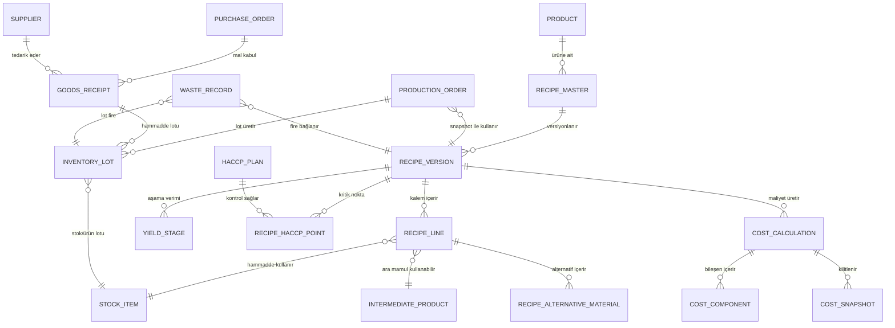
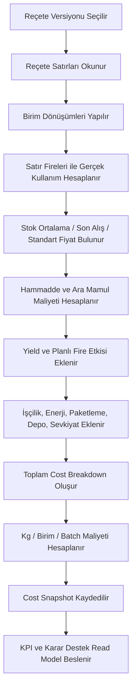
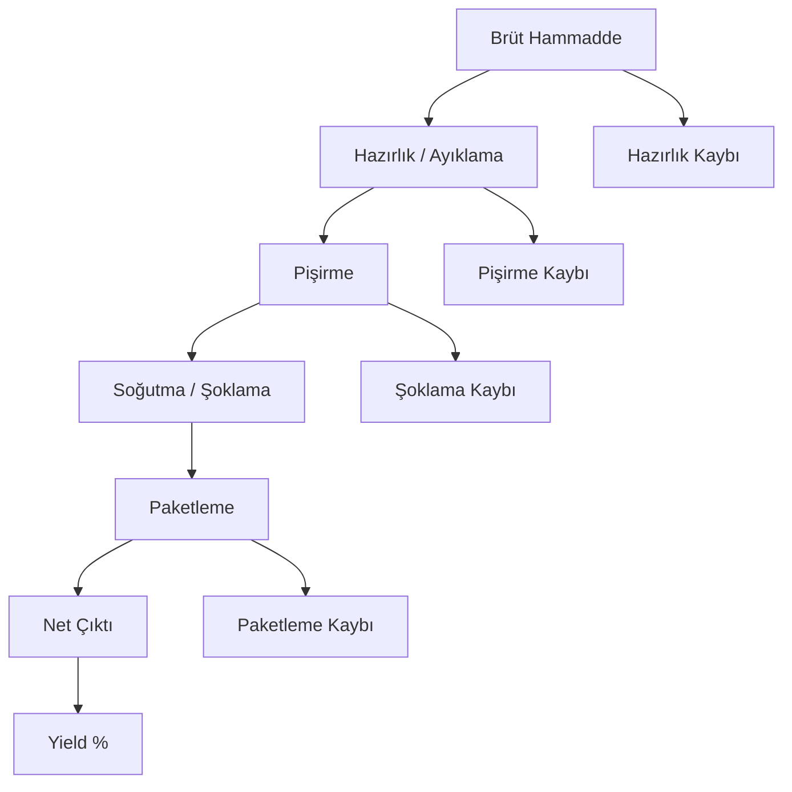
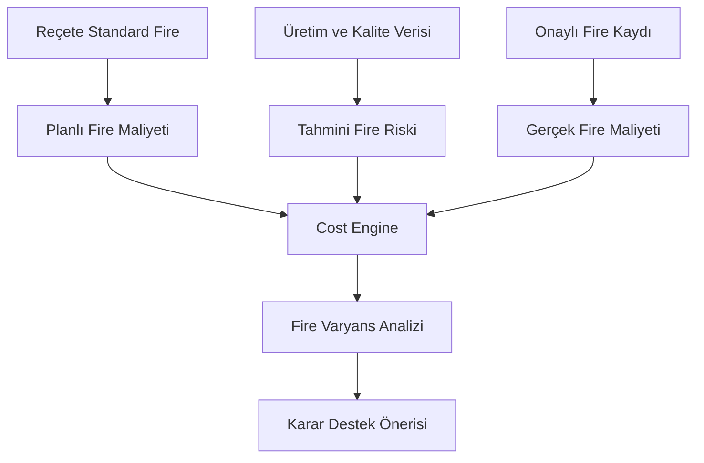
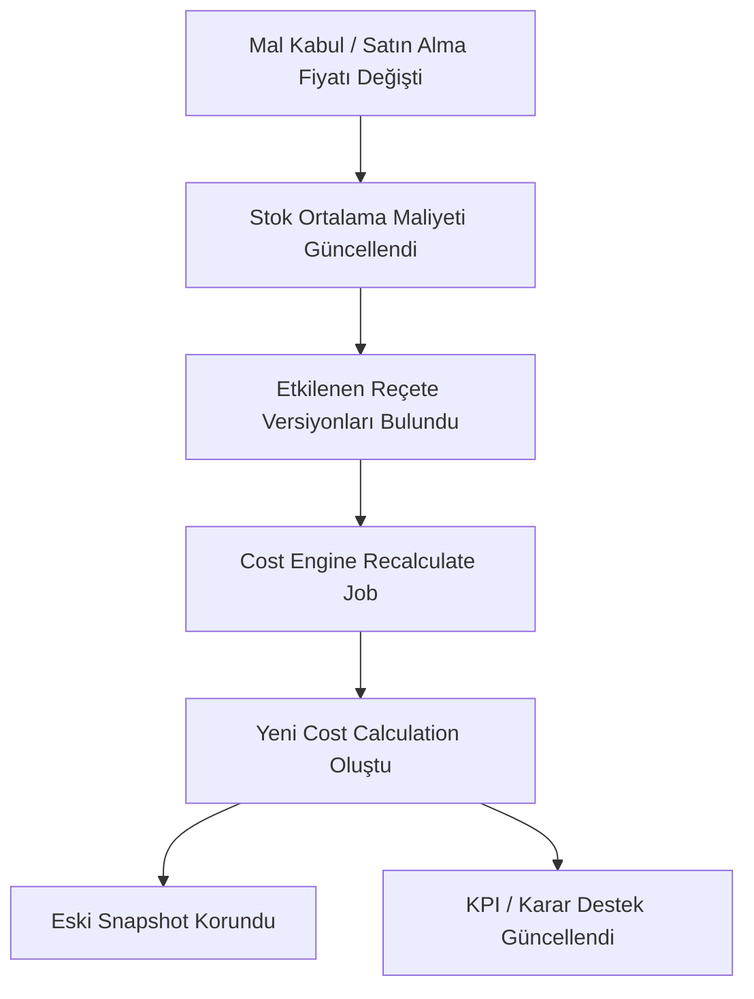
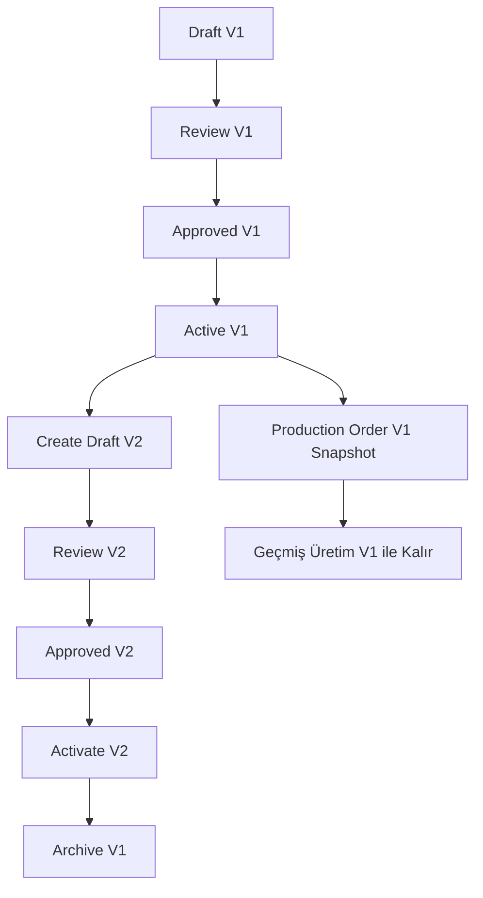
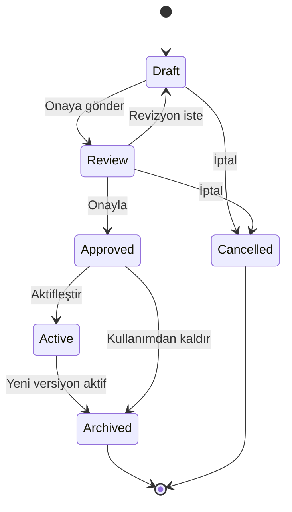
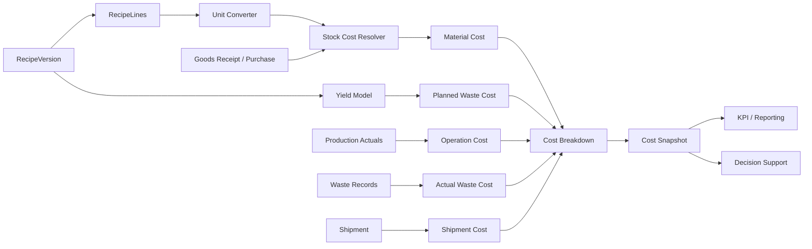

# Faz 34.4.0 - Reçete ve Maliyet Modeli Analiz Dokümanı

Bu doküman Reçete Yönetimi ve Cost Engine geliştirmesi öncesi domain sınırlarını, veri modelini, iş kurallarını ve hesaplama akışlarını netleştirir.

Bu fazda yeni ekran, component veya runtime davranışı eklenmez. Doküman mevcut sistem incelenerek hazırlanmıştır.

## 1. Mevcut Sistem Gözlemi

İncelenen ana kaynaklar:

| Alan | Mevcut kaynak | Mevcut yetenek | Analiz notu |
| --- | --- | --- | --- |
| Reçete yönetimi | `src/recipe-management/*` | Ana ürün / ara ürün, primary / alternative, ingredient, fire %, temel maliyet | Kurumsal reçete versiyonu, yield aşamaları, HACCP noktaları ve üretim merkezi alanları eksik |
| Operasyonel reçete | `src/types.ts`, `src/storage.ts`, `src/stockDeduction.ts` | Satış/adisyon stok düşümü için `Recipe`, `RecipeItem`, `recipeVersion`, `OrderRecipeSnapshot` | Üretim reçetesi ile satış tüketim reçetesi ayrımı netleştirilmeli |
| Cost Engine | `src/cost-engine/*` | Hammadde, ara ürün, fire, satın alma etkisi, işçilik, şoklama, paketleme, depo, sevkiyat, diğer bileşenler | İyi temel var; fiyat snapshot, maliyet dönemi ve versiyon bazlı hesap kaydı daha açık modellenmeli |
| Stok maliyeti | `src/stockCost.ts`, `src/storage.ts` | Ortalama maliyet, son alış fiyatı, birim alış fiyatı, ağırlıklı ortalama maliyet | Cost Engine bu kaynakları öncelik sırasıyla okumalı, eski maliyetleri snapshot olarak saklamalı |
| Lot / SKT | `src/inventory-lots/*`, `src/types.ts` | Lot, üretim tarihi, SKT, kalan miktar, tedarikçi, depo | Reçete kalemi tüketiminde lot seçim stratejisi FEFO/FIFO olarak kural haline getirilmeli |
| Fire | `src/waste-management/*`, `src/recipe-management/recipe-fire-engine.ts` | Planlı fire %, gerçekleşen fire kayıtları, fire maliyeti | Planlı fire, tahmini fire ve gerçekleşen fire ayrıştırılmalı |
| Üretim | `src/production-work-orders/*`, `src/production-planning/*` | Üretim emri, ürün satırı, miktar, durum, teslim tarihi | Üretim emri reçete versiyonu ve cost snapshot ile bağlanmalı |
| Kalite / HACCP | `src/haccp/*`, `src/quality-*` | CCP, üretim aşamaları, hazard, monitoring, corrective action | Reçete seviyesinde zorunlu HACCP nokta listesi gerekir |
| Karar Destek / KPI | `src/decision-support/*`, `src/kpi-reporting/*` | Read model, öneri, KPI hesapları | Cost Engine hesap çıktıları read-model olarak kullanılmalı |

Mevcut iki reçete ailesi vardır:

1. `RecipeManagementRecord`: üretim/menü reçetesi görünümü. `recipeType`, `recipeRole`, `parentRecipeId`, ingredient ve fire maliyeti içerir.
2. `Recipe`: satış/adisyon stok düşüm reçetesi. `recipeVersion`, `RecipeItem`, `RecipeCostSnapshot` ve `OrderRecipeSnapshot` içerir.

Sonraki fazlarda bu iki model tek domain dilinde birleştirilmeli veya açıkça iki bounded context olarak ayrılmalıdır:

- Üretim Reçetesi: endüstriyel mutfak üretim planı, yield, HACCP, lot ve maliyet için ana model.
- Tüketim Reçetesi: POS/adisyon kaynaklı stok düşümü için sade snapshot modeli.

## 2. Domain Relationship Diagram



## 3. Reçete Hiyerarşisi

### 3.1 Hiyerarşi Tanımları

| Kavram | Tanım | Örnek | Ana kural |
| --- | --- | --- | --- |
| Ana Reçete | Bir son ürünün varsayılan üretim yöntemi | Fırın Köfte Standart | Her ürün için aynı anda yalnızca bir aktif ana reçete olmalıdır |
| Alt Reçete | Ana reçetenin içinde kullanılan tekrar kullanılabilir alt yapı | Domates Sosu, Beşamel Sos | Bağımsız maliyetlenebilir olmalı |
| Ara Mamul | Üretim sürecinde başka reçeteye girdi olan ürün | Köfte Harcı, Pizza Hamuru | Stoklanabilir veya doğrudan hatta aktarılabilir |
| Yarı Mamul | Son ürüne dönüşmeden önce işlem görmüş çıktı | Marine Tavuk, Haşlanmış Nohut | Lot ve SKT izlenmelidir |
| Son Ürün | Müşteriye/sevkiyata gidecek nihai ürün | Paketli Sandviç, Lazanya | Etiket, SKT, HACCP ve maliyet snapshot taşır |
| Alternatif Reçete | Aynı ürün için farklı üretim yöntemi | Ekonomik Domates Sosu | Ana reçeteye bağlıdır, aktivasyonu kontrollüdür |
| Versiyonlu Reçete | Zaman içinde değişen reçete sürümü | V1, V2, V3 | Eski üretimler eski versiyonla kalır |

### 3.2 Önerilen Hiyerarşi

```text
RecipeMaster
  -> RecipeVersion V1
      -> RecipeLine: Hammadde
      -> RecipeLine: Ara Mamul RecipeVersion
      -> YieldStage
      -> HACCP Point
      -> CostSnapshot
  -> RecipeVersion V2
  -> Alternative RecipeMaster
      -> RecipeVersion V1
```

Ana karar:

- `RecipeMaster` ürünle kalıcı ilişkiyi temsil eder.
- `RecipeVersion` hesaplama, üretim ve onay için kullanılan değişmez reçete sürümüdür.
- Alternatif reçete bir satır alternatifi değil, aynı ürüne ait farklı `RecipeMaster` veya `RecipeVariant` olarak yönetilir.
- Alternatif hammadde ise reçete satırı seviyesinde `alternativeGroupId` ile yönetilir.

## 4. Reçete Yapısı

Önerilen ana entity: `RecipeVersion`.

| Alan | Tip | Zorunlu | Açıklama |
| --- | --- | --- | --- |
| id | string | Evet | Teknik kimlik |
| recipeMasterId | string | Evet | Ürün/reçete ailesi |
| code | string | Evet | Kurumsal reçete kodu |
| name | string | Evet | Reçete adı |
| versionNo | number | Evet | 1, 2, 3 |
| status | enum | Evet | Draft, Review, Approved, Active, Archived, Cancelled |
| recipeKind | enum | Evet | Main, SubRecipe, Intermediate, SemiFinished, Finished, Alternative |
| parentRecipeId | string | Hayır | Alternatif veya alt reçete bağı |
| productId | string | Evet | Ürün bağlantısı |
| productNameSnapshot | string | Evet | Üretim anı ürün adı |
| productionCenterId | string | Evet | Üretim merkezi |
| lineId | string | Hayır | Varsayılan hat |
| preparationMinutes | number | Evet | Hazırlama süresi |
| cookingMinutes | number | Evet | Pişirme süresi |
| restingMinutes | number | Evet | Dinlendirme süresi |
| totalMinutes | number | Hesap | Hazırlama + pişirme + dinlendirme + opsiyonel setup |
| batchOutputQuantity | number | Evet | Standart çıktı miktarı |
| batchOutputUnit | unit | Evet | kg, lt, adet, tepsi, koli |
| plannedWastePercent | number | Evet | Standart/planned fire |
| expectedYieldPercent | number | Hesap | Net çıktı / brüt girdi |
| shelfLifeDays | number | Evet | Raf ömrü |
| lotTrackingRequired | boolean | Evet | Lot izlenir mi? |
| expiryTrackingRequired | boolean | Evet | SKT izlenir mi? |
| haccpPointIds | string[] | Evet | Kritik kontrol noktaları |
| allergenTags | string[] | Gıda güvenliği | Alerjen etkisi |
| storageCondition | enum | Hayır | Ambient, Chilled, Frozen |
| approvedBy | string | Duruma bağlı | Onaylayan |
| approvedAt | datetime | Duruma bağlı | Onay tarihi |
| activatedAt | datetime | Duruma bağlı | Aktif tarih |
| createdAt / updatedAt | datetime | Evet | Audit |

### 4.1 Durum Modeli

| Durum | Anlam | Değiştirilebilir mi? | Üretimde kullanılabilir mi? |
| --- | --- | --- | --- |
| Draft | Taslak | Evet | Hayır |
| Review | Onay bekliyor | Sınırlı | Hayır |
| Approved | Onaylandı | Hayır, yeni versiyon gerekir | Planlamada kullanılabilir |
| Active | Varsayılan aktif versiyon | Hayır | Evet |
| Archived | Eski versiyon | Hayır | Yalnızca geçmiş kayıtlar |
| Cancelled | İptal | Hayır | Hayır |

## 5. Reçete Kalemleri

Önerilen entity: `RecipeLine`.

| Alan | Tip | Zorunlu | Açıklama |
| --- | --- | --- | --- |
| id | string | Evet | Satır kimliği |
| recipeVersionId | string | Evet | Reçete versiyonu |
| lineNo | number | Evet | Sıra |
| itemType | enum | Evet | RawMaterial, IntermediateProduct, SemiFinished, Packaging, Consumable |
| stockItemId | string | Koşullu | Hammadde/stok kalemi |
| childRecipeVersionId | string | Koşullu | Alt reçete/ara mamul |
| materialNameSnapshot | string | Evet | Üretim anı isim |
| quantity | number | Evet | Nominal kullanım |
| unit | unit | Evet | Reçete birimi |
| baseQuantity | number | Hesap | Ana birime çevrilmiş miktar |
| baseUnit | unit | Hesap | gr/ml/adet vb. |
| lineWastePercent | number | Evet | Satır bazlı fire |
| grossUsage | number | Hesap | quantity * (1 + lineWastePercent / 100) |
| yieldImpactPercent | number | Opsiyonel | Bu satırın yield etkisi |
| unitCostSnapshot | number | Evet | Hesap anı birim maliyet |
| currency | string | Evet | TRY varsayılan |
| costSource | enum | Evet | AverageCost, LastPurchase, Standard, Manual, Contract |
| costImpact | number | Hesap | grossUsage * unitCostSnapshot |
| alternativeGroupId | string | Hayır | Aynı fonksiyona sahip alternatifler |
| mandatory | boolean | Evet | Alternatifsiz zorunlu kalem |
| allergenImpact | string[] | Hayır | Alerjen mirası |
| notes | string | Hayır | Teknik not |

### 5.1 Gerçek Kullanım Formülü

```text
grossUsage = quantity * (1 + lineWastePercent / 100)
convertedUsage = convert(grossUsage, unit -> stockUnit)
lineCost = convertedUsage * unitCostSnapshot
```

Örnek:

```text
10 kg mozzarella
satır fire: %3
gerçek kullanım: 10.3 kg
birim maliyet: 180 TL/kg
satır maliyeti: 1.854 TL
```

## 6. Cost Engine Analizi

### 6.1 Maliyet Bileşenleri

| Bileşen | Kaynak | Hesap mantığı | Snapshot gerekli mi? |
| --- | --- | --- | --- |
| Hammadde | Reçete satırı + stok maliyeti | Gerçek kullanım * birim maliyet | Evet |
| Ara mamul | Alt reçete cost snapshot | Alt reçete batch maliyeti / kullanım miktarı | Evet |
| İşçilik | Üretim emri, vardiya, standart süre | Dakika * işçilik dakika maliyeti | Evet |
| Enerji | Makine/hat süreleri, katsayı | Makine süresi * enerji katsayısı | Evet |
| Paketleme | Paketleme reçete satırları veya süreç | Ambalaj kullanımı + paketleme işçiliği | Evet |
| Sarf | Eldiven, etiket, temizlik vb. | Ürün/batch katsayısı veya satır maliyeti | Evet |
| Fire | Planlı + tahmini + gerçekleşen | Fire miktarı * ilgili maliyet | Evet |
| Lojistik | İç transfer, handling | Miktar/mesafe/süre katsayısı | Evet |
| Sevkiyat | Shipment records | Bölge, araç, yakıt, teslimat katsayısı | Evet |
| Depolama | Lot bekleme, soğuk oda | Gün * miktar * depo katsayısı | Evet |
| Genel gider | Dönemsel overhead | Dağıtım anahtarı ile paylaştırma | Evet |

Mevcut `CostComponentType` listesi bu bileşenlerin çoğunu kapsıyor. Kurumsal modelde `ENERGY`, `CONSUMABLE`, `OVERHEAD`, `LOGISTICS` bileşenleri ayrı eklenmelidir; mevcut `OTHER` uzun vadede yalnızca sınıflandırılamayan küçük paylar için kullanılmalıdır.

### 6.2 Cost Calculation Flow



### 6.3 Ana Formüller

```text
lineGrossQty = lineQty * (1 + lineWastePercent / 100)
lineCost = converted(lineGrossQty, stockUnit) * unitCostSnapshot

rawMaterialCost = sum(lineCost where itemType in RawMaterial, Packaging, Consumable)
subRecipeCost = sum(childRecipeCostPerBaseUnit * convertedUsage)

plannedWasteCost = (rawMaterialCost + subRecipeCost) * plannedWastePercent / 100
actualWasteCost = sum(approved waste records linked to production/recipe)

directCost = rawMaterialCost + subRecipeCost + packagingCost + consumableCost
operationCost = laborCost + energyCost + storageCost + logisticsCost + shipmentCost
overheadCost = overheadBase * overheadRate

totalBatchCost = directCost + plannedWasteCost + actualWasteCost + operationCost + overheadCost
costPerOutputUnit = totalBatchCost / netOutputQuantity
costPerKg = totalBatchCost / netOutputKg
```

### 6.4 Maliyet Kaynak Önceliği

Bir hammadde için fiyat seçimi:

1. Aktif sözleşme fiyatı veya onaylı tedarikçi fiyatı
2. Lot bazlı mal kabul birim maliyeti
3. Stok kartı ağırlıklı ortalama maliyeti
4. Son alış fiyatı
5. Standart reçete birim maliyeti
6. Manuel maliyet fallback

Her hesapta seçilen kaynak `costSource`, `sourceId`, `unitCostSnapshot`, `calculatedAt` olarak saklanmalıdır.

## 7. Yield Analizi

Yield, brüt girdinin net kullanılabilir çıktıya dönüşme oranıdır. Fire ile ilişkilidir ama birebir aynı değildir.

### 7.1 Yield Flow



### 7.2 Yield Stage Modeli

| Alan | Açıklama |
| --- | --- |
| stage | Receiving, Preparation, Cooking, BlastChilling, Packaging, Dispatch |
| inputQuantity | Aşamaya giren miktar |
| outputQuantity | Aşamadan çıkan miktar |
| lossQuantity | input - output |
| lossPercent | loss / input |
| reason | Buharlaşma, temizleme, kemik ayrımı, kırpıntı, paketleme firesi |
| measurementSource | Standard, ProductionActual, QualityResult |

### 7.3 Yield Formülü

```text
stageYield = outputQuantity / inputQuantity * 100
totalYield = finalNetOutput / firstGrossInput * 100
yieldLoss = firstGrossInput - finalNetOutput
```

Örnek:

```text
100 kg et
Hazırlık sonrası: 96 kg
Pişirme sonrası: 91 kg
Şoklama sonrası: 90 kg
Yield = 90 / 100 * 100 = %90
```

### 7.4 Yield İş Kuralları

- Yield %0 veya negatif olamaz.
- Yield %100 üstü ancak proses gereği su/hamur hacim artışı gibi tanımlı istisnalarda mümkündür.
- Reçete standard yield ile üretim gerçekleşen yield ayrı tutulur.
- Cost Engine varsayılan olarak approved standard yield kullanır.
- Üretim tamamlandığında gerçekleşen yield hesaplanır ve varyans analizi yapılır.
- Yield düşüşü maliyeti artırır; cost per kg net çıktı üzerinden hesaplanmalıdır.

## 8. Fire Analizi

Fire üç ayrı katmanda modellenmelidir:

| Fire katmanı | Anlam | Kaynak |
| --- | --- | --- |
| Planlı Fire | Reçete standardında beklenen kayıp | RecipeVersion / RecipeLine |
| Tahmini Fire | Karar Destek veya tahminleme sonucu beklenen risk | Waste Prediction |
| Gerçekleşen Fire | Onaylı operasyon/fire kaydı | Waste Management |

### 8.1 Fire Flow



### 8.2 Fire Aşamaları

| Aşama | Örnek neden | Cost Engine davranışı |
| --- | --- | --- |
| Hazırlık | Ayıklama, kemik, kabuk, yıkama kaybı | Planlı yield kaybına dahil |
| Üretim | Yanlış tartım, proses sapması | Gerçekleşen fire olarak maliyete yansır |
| Pişirme | Buharlaşma, yanma, fazla pişirme | Yield stage + kalite sonucu ile ilişkilendirilir |
| Paketleme | Dökülme, kırık ambalaj, etiket hatası | Paketleme fire bileşeni |
| Sevkiyat | Taşıma hasarı, sıcaklık sapması | Sevkiyat/fire maliyeti |
| Son Kullanma | SKT geçmesi, depo bekleme | Depo ve SKT fire maliyeti |

### 8.3 Fire Hesap Kuralları

```text
plannedWasteQty = recipeOutputQty * plannedWastePercent / 100
lineWasteQty = recipeLineQty * lineWastePercent / 100
actualWasteCost = approvedWasteQty * wasteUnitCost
wasteVariance = actualWasteCost - plannedWasteCost
wasteVariancePercent = wasteVariance / plannedWasteCost * 100
```

İş kuralı:

- Taslak, reddedilmiş veya iptal edilmiş fire kayıtları Cost Engine’e dahil edilmez.
- Onaylı fire kayıtları ilgili production order, recipe version, lot ve stock item üzerinden bağlanır.
- Fire kaydı stok düşümü yaratabilir, ancak bu analiz fazında Cost Engine yalnızca okur.

## 9. Alternatif Hammadde

Alternatif hammadde reçete satırı seviyesinde yönetilmelidir.

Örnek:

```text
Mozzarella A yoksa Mozzarella B kullanılabilir.
Mozzarella B kullanılırsa:
  - maliyet yeniden hesaplanır
  - alerjen ve kalite eşdeğerliği kontrol edilir
  - yield etkisi farklı ise net çıktı güncellenir
  - reçete versiyonu değişmeden üretim bazlı substitution snapshot alınır
```

### 9.1 Alternatif Grup Modeli

| Alan | Açıklama |
| --- | --- |
| alternativeGroupId | Aynı fonksiyonu karşılayan malzeme grubu |
| priority | 1 varsayılan, 2/3 alternatif |
| substitutionRatio | 1 kg A yerine kaç kg B kullanılacak |
| maxUsagePercent | Alternatifin toplam satırdaki maksimum payı |
| qualityEquivalent | Kalite eşdeğer mi? |
| allergenCompatible | Alerjen profili uyumlu mu? |
| haccpCompatible | HACCP noktaları değişiyor mu? |
| approvalRequired | Kullanım için kalite/üretim onayı gerekir mi? |
| costImpactPolicy | Maliyet farkı nasıl raporlanır? |

### 9.2 Alternatif Hammadde İş Kuralları

- Alternatif hammadde ana reçeteyi otomatik değiştirmez.
- Üretim emrinde kullanılan alternatifler snapshot olarak saklanır.
- Alerjen profili farklıysa kalite onayı olmadan kullanılamaz.
- HACCP kritik limiti değişiyorsa yeni reçete versiyonu gerekir.
- Alternatif kullanım maliyet farkı Cost Engine’de `SUBSTITUTION_VARIANCE` veya `PURCHASING` etkisi olarak izlenmelidir.
- Alternatif hammadde stokta yoksa sistem öneri üretir, üretimi otomatik değiştirmez.

## 10. Maliyet Güncelleme Stratejisi

Hammadde fiyatı değiştiğinde reçete tanımı otomatik değişmemelidir. Reçete standardı ve maliyet hesap sonucu ayrı tutulmalıdır.

### 10.1 Olay Bazlı Strateji



### 10.2 Saklama Politikası

| Veri | Güncellenir mi? | Saklama |
| --- | --- | --- |
| Reçete satır miktarı | Hayır | Versiyon değişikliği gerekir |
| Reçete standard unit cost | Hayır, snapshot | Eski maliyet korunur |
| Stok average cost | Evet | Stok hareketi ile güncellenir |
| Cost calculation | Yeni kayıt | Eski hesap kayıtları saklanır |
| Production order cost snapshot | Hayır | Üretim anındaki snapshot korunur |
| KPI read model | Evet | Son hesapları gösterir |

### 10.3 Yeniden Hesaplama Tetikleyicileri

- Mal kabul onaylandı.
- Stok ortalama maliyeti değişti.
- Reçete yeni versiyona geçti.
- Fire kayıtları onaylandı.
- Üretim emri tamamlandı.
- Enerji/işçilik/overhead dönem katsayıları güncellendi.
- Alternatif hammadde kullanımı onaylandı.
- Lot/SKT nedeniyle hammadde kullanım stratejisi değişti.

## 11. Versiyonlama

Reçete versiyonları immutable kabul edilmelidir.

### 11.1 Versioning Flow



### 11.2 Versiyon Kuralları

- Aktif reçete üzerinde doğrudan değişiklik yapılamaz.
- Değişiklik gerekiyorsa yeni draft versiyon açılır.
- Yeni versiyon aktif olunca eski versiyon archived olur.
- Eski üretimler, eski stok hareketleri ve eski maliyet snapshotları eski versiyonu kullanır.
- Üretim emri oluşturulduğu anda `recipeVersionId` ve cost snapshot yakalanır.
- Üretim başladıktan sonra reçete versiyonu değiştirilemez.
- Reçete satırında miktar, hammadde, yield, HACCP veya alerjen değişirse yeni versiyon gerekir.
- Yalnızca açıklama gibi operasyonel olmayan alanlar minor revision olarak auditlenebilir.

## 12. Recipe Lifecycle



Lifecycle iş kuralları:

- Draft reçete maliyet simülasyonu yapabilir ancak üretim emrinde kullanılamaz.
- Review reçete değiştirilemez; revizyon için Draft’a döner.
- Approved reçete planlama tarafından görülebilir, ancak varsayılan değildir.
- Active reçete yeni üretimlerin varsayılan reçetesidir.
- Archived reçete yalnızca geçmiş izlenebilirlik ve raporlama için kalır.

## 13. Cost Engine Flow



## 14. Entity Relationship Mapping

### 14.1 Önerilen Target Entity Listesi

| Entity | Amaç | Mevcut karşılığı |
| --- | --- | --- |
| RecipeMaster | Ürün reçete ailesi | Kısmen `RecipeManagementRecord.productName` |
| RecipeVersion | Onaylı/aktif sürüm | Kısmen `RecipeManagementRecord`, `Recipe.recipeVersion` |
| RecipeLine | Hammadde/ara mamul satırı | `RecipeIngredient`, `RecipeItem` |
| RecipeAlternativeMaterial | Satır alternatifi | Yok |
| RecipeYieldStage | Aşama verimi | Yok |
| RecipeHaccpPoint | Reçete-CCP bağı | HACCP var, reçete bağı yok |
| RecipeCostSnapshot | Reçete/üretim anı maliyet | `RecipeCostSnapshot` sade mevcut |
| CostCalculation | Bir hesap çalıştırması | `CostEngine` |
| CostComponent | Maliyet bileşeni | `CostComponent` |
| CostScenario | Simülasyon | `CostScenario` |
| ProductionRecipeSnapshot | Üretim emri reçete snapshot | `OrderRecipeSnapshot`, production tarafında eksik |
| MaterialPriceSnapshot | Hammadde fiyat snapshot | Yok |
| YieldActual | Üretim gerçekleşen yield | Yok |
| WasteVariance | Planlı/gerçek fire farkı | Kısmen Waste + Cost |

### 14.2 İlişki Kuralları

- Product 1 - N RecipeMaster olabilir; aynı anda yalnızca bir active primary master olmalıdır.
- RecipeMaster 1 - N RecipeVersion içerir.
- RecipeVersion 1 - N RecipeLine içerir.
- RecipeLine ya StockItem ya ChildRecipeVersion referansı taşır; ikisi aynı anda dolu olmamalıdır.
- RecipeVersion 1 - N YieldStage içerir.
- RecipeVersion N - N HACCP CCP ilişkisi taşır.
- CostCalculation bir RecipeVersion ve hesap dönemi için üretilir.
- ProductionOrder bir RecipeVersion snapshot ile kilitlenir.
- InventoryLot üretim veya mal kabul kaynağına bağlanır.
- WasteRecord üretim emri, recipe version, lot ve stock item ile bağlanmalıdır.

## 15. Entegrasyon Analizi

| Modül | Okunacak veri | Yazılacak/üretilecek veri | Kural |
| --- | --- | --- | --- |
| 34.2 Depo ve Stok | StockItem, StockMovement, InventoryLot, SKT, average cost | Cost Engine doğrudan stok hareketi oluşturmaz | Stok maliyeti snapshot alınır |
| 34.3 Üretim | ProductionOrder, gerçekleşen süre, üretim miktarı | Production cost snapshot | Üretim başladıktan sonra reçete değişmez |
| 34.5 Satın Alma | PurchaseOrder, GoodsReceipt, supplier price | Material price snapshot | Fiyat değişimi cost recalculation tetikler |
| 34.6 Sevkiyat | Shipment, route, vehicle, delivery cost | Shipment cost component | Sevkiyat planını değiştirmez |
| 34.7 Kalite | HACCP, kalite kontrol, numune, recall | Quality risk/cost flag | HACCP uyumsuzluğu üretim/maliyet riskidir |
| 34.8 KPI | Cost, yield, waste, margin KPI | Read model | KPI son hesapları gösterir |
| 34.13 Karar Destek | Forecast, waste prediction, purchase recommendation | Öneri ve risk sinyali | Gerçek reçete/plan değişikliği yapmaz |

## 16. Hesaplama Kuralları

### 16.1 Birim Dönüşümü

- kg -> gr: * 1000
- lt -> ml: * 1000
- gr/ml/adet/paket/koli/kasa/çuval kendi base unit değerini korur.
- Dönüşümü bilinmeyen birim çifti hesaplamayı durdurmalı veya satırı `missingConversion` olarak işaretlemelidir.

### 16.2 Yuvarlama

- Stok miktarları: 6 hane hassasiyet.
- Para: hesap içi 4 hane, raporlama 2 hane.
- Yüzde: 2 hane.
- Final display: locale `tr-TR`, currency `TRY` varsayılan.

### 16.3 Maliyet Snapshot

Her cost snapshot şu alanları taşımalıdır:

- recipeVersionId
- productId
- productionOrderId opsiyonel
- calculationType: STANDARD / ESTIMATED / ACTUAL / SIMULATION
- calculationDate
- currency
- totalCost
- costPerKg
- costPerUnit
- netOutputQuantity
- grossInputQuantity
- yieldPercent
- plannedWasteCost
- actualWasteCost
- materialPriceSnapshot[]
- costComponents[]
- sourceReferences[]

### 16.4 Standard / Estimated / Actual Ayrımı

| Tip | Ne zaman hesaplanır? | Kaynak |
| --- | --- | --- |
| STANDARD | Reçete onayında | Standart miktar ve standart maliyet |
| ESTIMATED | Üretim planlama aşamasında | Güncel stok/satın alma/fiyat tahmini |
| ACTUAL | Üretim tamamlanınca | Gerçek üretim, gerçek fire, gerçek süre |
| SIMULATION | Karar destek senaryosu | Varsayımsal değişiklikler |

## 17. İş Kuralları

### 17.1 Reçete İş Kuralları

- Reçete kodu tenant/şube kapsamında benzersiz olmalıdır.
- Aynı ürün için yalnızca bir aktif primary reçete olabilir.
- Alternatif reçete, primary reçete ile aynı ürüne bağlı olmalıdır.
- Alternatif reçete kendisine veya child reçetesine parent olamaz.
- Reçete satırı miktarı 0 veya negatif olamaz.
- Fire yüzdesi 0-100 aralığında olmalıdır.
- Aktif reçete doğrudan değiştirilemez; yeni versiyon gerekir.
- HACCP kritik nokta eksikse reçete Active olamaz.
- Lot tracking zorunlu ürünlerde reçete satırları lot tüketim stratejisi taşımalıdır.
- Alerjen etkisi olan alternatif hammadde kalite onayı olmadan kullanılamaz.

### 17.2 Cost Engine İş Kuralları

- Cost Engine stok hareketi, muhasebe kaydı veya üretim emri oluşturmaz.
- Cost Engine yalnızca hesaplama ve snapshot üretir.
- Eski cost snapshot asla üzerine yazılmaz.
- İptal/reddedilmiş fire kayıtları hesaplamaya dahil edilmez.
- Eksik fiyat varsa hesap devam edebilir, ancak `missingCostItemCount` ve risk bayrağı oluşmalıdır.
- Negatif maliyet kabul edilmez.
- Toplam maliyet gerçekçi üst limitlerle guard edilmelidir.
- Hesapta kullanılan tüm kaynaklar audit için `sourceReferences` olarak saklanmalıdır.
- Alternatif hammadde kullanımı reçeteyi değiştirmez, üretim snapshotında görünür.

### 17.3 Üretim ve Versiyon İş Kuralları

- Üretim emri oluşturulurken aktif recipe version snapshot alınır.
- Üretim başladıktan sonra snapshot değiştirilemez.
- Reçete V2 aktif olsa bile V1 ile açılmış üretim emri V1 ile kapanır.
- Üretim gerçekleşen verisi ACTUAL cost calculation oluşturur.
- Tamamlanan üretimden sonra yield ve fire varyansı hesaplanır.

## 18. Eksikler ve Sonraki Faz Kararları

| Eksik | Etki | Öneri |
| --- | --- | --- |
| Tekil kurumsal RecipeVersion modeli yok | Üretim, stok düşümü ve cost aynı dili konuşmuyor | `RecipeMaster` + `RecipeVersion` ayrımı kurulmalı |
| Yield stage yok | Net çıktı ve maliyet/kg eksik hesaplanabilir | `RecipeYieldStage` eklenmeli |
| HACCP reçete bağı yok | Gıda güvenliği onay akışı eksik | `RecipeHaccpPoint` ilişkisi eklenmeli |
| Alternatif hammadde satır modeli yok | Satın alma/stok yokluğunda kontrollü ikame zor | `RecipeAlternativeMaterial` eklenmeli |
| Material price snapshot yok | Eski maliyetler yeniden üretilemez | Her cost calculation fiyat snapshot taşımalı |
| ProductionOrder recipeVersion bağı zayıf | Eski üretim-eski reçete kuralı garanti değil | Üretim emri snapshot alanı eklenmeli |
| Energy/overhead ayrı component değil | Maliyet bileşenleri kurumsal rapora eksik yansır | `ENERGY`, `OVERHEAD`, `CONSUMABLE`, `LOGISTICS` ayrılmalı |
| Fire plan/tahmin/gerçek ayrımı tam değil | Varyans ve karar destek hatalı yorumlanabilir | Fire üç katmanda modellenmeli |
| Alt reçete recursive maliyet guard yok | Döngü/circular dependency riski | Reçete graph cycle validation eklenmeli |

## 19. Sonraki Implementasyon İçin Önerilen Sıra

1. Domain type tasarımı: `RecipeMaster`, `RecipeVersion`, `RecipeLine`, `RecipeYieldStage`, `RecipeCostSnapshot`.
2. Migration/adaptör: mevcut `RecipeManagementRecord` ve `Recipe` modellerini yeni read model’e map etme.
3. Unit conversion service genişletme.
4. Price resolver ve material price snapshot.
5. Recursive sub-recipe cost calculation, cycle validation ile.
6. Yield calculation service.
7. Waste variance calculation service.
8. Cost component expansion: energy, consumable, overhead, logistics.
9. Production order recipe snapshot entegrasyonu.
10. KPI ve Decision Support read-model entegrasyonu.

## 20. Tamamlanma Kontrolü

- Reçete domain modeli ortaya çıkarıldı.
- Cost Engine veri ihtiyaçları tanımlandı.
- Yield hesap modeli tanımlandı.
- Fire modeli planlı/tahmini/gerçekleşen olarak ayrıştırıldı.
- Versioning stratejisi netleştirildi.
- Entity ilişkileri belirlendi.
- Mevcut sistem boşlukları ve sonraki faz kararları listelendi.
- Bu fazda ekran, component veya runtime davranışı değiştirilmedi.
